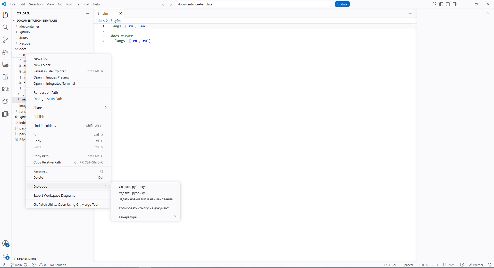
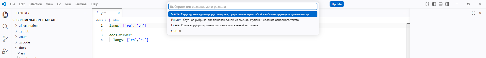
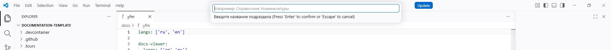
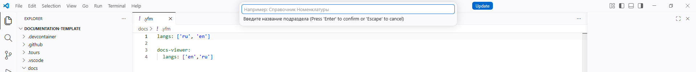

# Diplodoc Helper

## Установка

### marketplace

Установка осуществляется через [ссылку](https://marketplace.visualstudio.com/items?itemName=paulyestchick.diplodochelper)

### git

#### clone

Выполнить команду в терминале

```bash
git clone https://github.com/paulyeshchyk/diplodocHelper.git
```

#### build

Выполнить команду в терминале

```bash
cd diplodocHelper
npm install gray-matter@^4.0.3
mkDir build
vsce package --out build/ --allow-missing-repository
```

#### vsix install

Выполнить команду в терминале

```bash
code --install-extension diplodochelper-0.7.0.vsix
```

## Сводка функций

| Применяемость  | Наименование                                                                                                                                                   | Этап                   |
| -------------- | -------------------------------------------------------------------------------------------------------------------------------------------------------------- | ---------------------- |
| Разделы        | [Создание раздела (`diplodoc-helper.createSection`)](#1-создание-раздела-diplodoc-helpercreatesection)                                                         | Редактирование         |
|                | [Удаление раздела (`diplodoc-helper.deleteSection`)](#2-удаление-раздела-diplodoc-helperdeletesection))                                                        | Редактирование         |
|                | [Переименование раздела и смена типа (`diplodoc-helper.renameSection`)](#3-переименование-раздела-и-смена-типа-diplodoc-helperrenamesection) Редактирование    |
|                | [Переиндексация (`diplodoc-helper.reindex`)](#8-переиндексация-diplodoc-helperreindex)                                                                         | Редактирование, Сборка |
| Ссылки         | [Копирование ссылки на статью (`diplodoc-helper.copyLink`)](#4-копирование-ссылки-на-статью-diplodoc-helpercopylink)                                           | Редактирование         |
|                | [Вставка ссылки на статью (`diplodoc-helper.pasteLink`)](#5-вставка-ссылки-на-статью-diplodoc-helperpastelink)                                                 | Редактирование         |
| Индексация     | [Генерация краткого указателя (`diplodoc-helper.generateContexts`)](#6-генерация-краткого-указателя-diplodoc-helpergeneratecontexts)                           | Редактирование, Сборка |
|                | [Генерация списка контекстов для фронтенда (`diplodoc-helper.generateHelpMaps`)](#7-генерация-списка-контекстов-для-фронтенда-diplodoc-helpergeneratehelpmaps) | Редактирование, Сборка |
| Хлебные крошки | [Хлебные крошки (`inject-breadcrumb.js`)](#9-хлебные-крошки-inject-breadcrumbjs)                                                                               | Сборка                 |

## Команды расширения Diplodoc Helper

### 1. Создание раздела (`diplodoc-helper.createSection`)

**Без расширения**  
Приходится вручную создавать папку, в ней — `index.md`, `index.yaml`, `toc.yaml`, заполнять frontmatter (title, sectionType, pureTitle, sectionIndex), затем редактировать родительский `toc.yaml` — добавлять новый элемент `items` с правильным `name`, `href`, `include`. Нужно помнить структуру Diplodoc и синтаксис YAML.

**С расширением**  
Достаточно выбрать тип раздела (Часть/Раздел/Глава/Статья), ввести название и (при необходимости) индекс. Расширение само создаёт папку со всеми служебными файлами, заполняет метаданные и добавляет запись в родительское оглавление.

---

### 2. Удаление раздела (`diplodoc-helper.deleteSection`)

**Без расширения**  
Приходится вручную удалять папку раздела, а затем открывать родительский `toc.yaml` и удалять соответствующий блок `items`. При большом количестве разделов легко пропустить или оставить мусор в оглавлении.

**С расширением**  
Достаточно нажать на разделе в проводнике «Удалить рубрику». Расширение автоматически удаляет запись из родительского `toc.yaml` и только после этого безвозвратно удаляет папку раздела. Оглавление остаётся чистым.

---

### 3. Переименование раздела и смена типа (`diplodoc-helper.renameSection`)

**Без расширения**  
Приходится вручную переименовывать папку, править `title`, `pureTitle`, `sectionType`, `sectionIndex` в `index.md` и `index.yaml`, менять заголовок в `toc.yaml` раздела, а затем обновлять ссылки в родительском `toc.yaml` (имя папки, отображаемое название) и, возможно, в `index.yaml` родителя. Это очень трудоёмко и чревато ошибками.

**С расширением**  
Выбираете новый тип раздела, вводите новое название и (при необходимости) индекс. Расширение само обновляет все метаданные во всех служебных файлах, переименовывает папку (если нужно) и корректирует ссылки в родительских `toc.yaml` и `index.yaml`.

---

### 4. Копирование ссылки на статью (`diplodoc-helper.copyLink`)

**Без расширения**  
Приходится вручную копировать путь к файлу (например, `Часть1.Введение/index.md`) и вставлять его вручную в Markdown-ссылку `[текст](путь)`. Для картинок нужно запоминать синтаксис ``.

**С расширением**  
Достаточно кликнуть правой кнопкой на любой папке (разделе) или `.md`/`.png`/`.jpg`/`.svg` файле и выбрать «Копировать ссылку на документ». Расширение сохраняет в буфер обмена JSON-объект с именем и путём. При вставке автоматически формируется корректная относительная ссылка.

---

### 5. Вставка ссылки на статью (`diplodoc-helper.pasteLink`)

**Без расширения**  
Нужно вручную вычислять относительный путь от текущего редактируемого файла до целевого раздела или картинки, кодировать кириллические имена, вставлять в квадратные скобки и круглые. Для картинок не забыть восклицательный знак.

**С расширением**  
В редакторе Markdown или YAML достаточно нажать «Вставить ссылку на документ». Расширение читает данные из буфера (скопированные командой `copyLink`), вычисляет относительный путь с учётом текущего файла, кодирует сегменты URL и вставляет `[имя](относительный/путь)` или `` для изображений.

---

### 6. Генерация краткого указателя (`diplodoc-helper.generateContexts`)

**Без расширения**  
Чтобы сделать страницу «Контексты» (список терминов со ссылками на статьи), пришлось бы вручную обходить все `.md` файлы, искать тег `context:`, выписывать термины и создавать для каждого отдельную страницу со списком ссылок, генерировать `index.md`, `toc.yaml`, `index.yaml`. При добавлении новых статей поддерживать вручную.

**С расширением**  
Достаточно выполнить команду. Расширение сканирует папки `docs/ru` и `docs/en`, находит все статьи с frontmatter-полем `context:`, собирает уникальные термины, создаёт для каждого термина `.md` файл со списком ссылок, генерирует `index.md` (алфавитный указатель), `toc.yaml` и `index.yaml` в папке `contexts`. Указатель всегда актуален.

---

### 7. Генерация списка контекстов для фронтенда (`diplodoc-helper.generateHelpMaps`)

**Без расширения**  
Фронтенд-разработчикам для интеграции подсказок (help) нужен JSON-файл, сопоставляющий URL статьи с заголовком, подсказкой и тегом `helptag`. Вручную пришлось бы обходить все `.md` файлы, читать frontmatter, формировать массив записей и сохранять в `build/app-help-contents.json`. При изменении документации файл легко устаревает.

**С расширением**  
Команда автоматически обходит все `.md` файлы в `docs`, извлекает `helptag`, `title`, `hint`, формирует массив записей с полями `url`, `title`, `hint`, `context`, `lang` и сохраняет в `build/` (или с разделением по языкам при флаге `--segregation`). Фронтенд всегда имеет свежую help-карту.

---

### 8. Переиндексация (`diplodoc-helper.reindex`)

**Без расширения**  
Когда разделы перемещают, переименовывают или меняют индексы (например, «1.2. Введение» → «1.3. Введение»), приходится вручную править `sectionIndex` во всех `index.md`, затем обновлять заголовки в `index.yaml`, `toc.yaml` раздела, а также исправлять ссылки в родительских `toc.yaml`. Часто забывают синхронизировать имена папок с новыми индексами.

**С расширением**  
Достаточно выполнить команду на корневой папке документации. Расширение рекурсивно проходит все разделы, вычисляет новые индексы на основе порядка папок (или сохраняет ручные индексы), обновляет все метаданные во всех служебных файлах, переименовывает папки в соответствии с новым индексом и названием, а затем сортирует записи в родительских `toc.yaml`. Всё оглавление и ссылки остаются валидными.

---

### 9. Хлебные крошки (`inject-breadcrumb.js`)

**Без расширения**  
Чтобы на каждой странице документации отображалась навигационная цепочка (например, «Главная → Раздел 1 → Подраздел»), нужно вручную править шаблоны сборки или писать кастомный скрипт, который извлекает заголовки родительских страниц из `index.html` и вставляет HTML-структуру. При изменении структуры документации крошки приходится перестраивать заново.

**С расширением**  
Скрипт (`inject-breadcrumb.js`) запускается после сборки документации (`@diplodoc/cli`). Он сканирует все `index.html` в папке `build`, по пути собирает родительские сегменты, извлекает из сгенерированных HTML-файлов заголовки страниц (из `diplodoc-state` или `<title>`), формирует навигационную цепочку и вставляет `nav` с крошками сразу перед основным содержимым страницы. Крошки обновляются автоматически при каждой сборке.

## С чего начать

### Базис

Начните с загрузки стандартного проекта diplodoc, размещенного по [ссылке](https://github.com/diplodoc-platform/documentation-template)

---

Откройте проект, убедившись, что в папке `docs` есть две подпапки `en` и `ru`

---

Установите данное расширение.

---

После установки расширение, возможно, потребуется перезагрузка VS Code. После перезагрузки, в VS Code откройте зангуренный Вами проект documentation-template

---

В древовидной иерархии папок VS Code, под названием Explorer, найдите папку docs а в ней либо ru либо en. Если расширение из п.2 было установлено, тогда нажмите ПКМ. В появившемся меню должно быть подменю `diplodoc` 

---

Выберите подменю `Создать рубрику`, и следуйте дальнейшим инструкциям

- тип 
- название секции 
- индекс 

---

В результате, у Вас должно получиться создать новый подраздес а автоматическим обновлением toc.yaml

### Копирование

Функция `Копирование ссылки на статью` имеет пару `Вставка ссылки на статью`. Не путайте со стандартном механизмом `Копирования-Вставки`.

P.S. Функция вставки ссылки на статью будет работать только в документе формата md, yaml

[результат](./readme_images/section-creation-result.png)

## Базовый набор задач, исполняемых в VS Code

- `1. Собрать документацию` преобразовывает(собирает) весь набор md-файлов в набор html- файлов
- `2. Открыть (локальный сервер)` преобразовывает(собирает) весь набор md-файлов в набор html- файлов, запуская локальный http-server. Результат сборки будет доступен по адресу `localhost:5050`
- `5. docker: build image` преобразовывает(собирает) весь набор md-файлов в набор html- файлов, компонуя из них docker-container

```tasks.json
{
  "version": "2.0.0",
  "tasks": [
    {
      "label": "1. Собрать документацию",
      "dependsOn": [
        "0.1 clean-build",
        "0.1 generate-contexts",
        "0.1 generate-helpmaps",
        "0.2 build-docs",
        "0.3 inject-breadcrumb",
        "0.4 clean-temp"
      ],
      "dependsOrder": "sequence",
      "problemMatcher": [],
      "group": {
        "kind": "build",
        "isDefault": true
      },
      "presentation": {
        "close": false,
        "clear": false,
        "panel": "shared",
        "showReuseMessage": false
      }
    },
    {
      "label": "2. Открыть (локальный сервер)",
      "type": "shell",
      "command": "node .vscode/scripts/open-url.js http://localhost:${config:docbuilder.port}",
      "dependsOn": [
        "4. Запустить HTTP сервер"
      ],
      "problemMatcher": [],
      "presentation": {
        "reveal": "never",
        "close": true,
        "panel": "shared",
        "showReuseMessage": false
      }
    },
    {
      "label": "2. Открыть (локальный файл)",
      "type": "shell",
      "command": "node .vscode/scripts/open-file.js build/index.html",
      "dependsOn": [
        "1. Собрать документацию"
      ],
      "dependsOrder": "sequence",
      "problemMatcher": [],
      "group": {
        "kind": "test",
        "isDefault": false
      },
      "presentation": {
        "reveal": "never",
        "close": true,
        "panel": "shared",
        "showReuseMessage": false
      }
    },
    {
      "label": "3. Подготовка окружения",
      "dependsOn": [
        "0.7 npm clean-install"
      ],
      "dependsOrder": "sequence",
      "problemMatcher": [],
      "presentation": {
        "reveal": "always",
        "panel": "dedicated",
        "clear": true,
        "showReuseMessage": false
      }
    },
    {
      "label": "4. Запустить HTTP сервер",
      "type": "shell",
      "command": "node .vscode/scripts/start-http-server.js ${config:docbuilder.port}",
      "isBackground": true,
      "problemMatcher": {
        "pattern": {
          "regexp": "^.*$",
          "file": 1,
          "location": 2,
          "message": 3
        },
        "background": {
          "activeOnStart": true,
          "beginsPattern": "Starting up",
          "endsPattern": "Available on"
        }
      },
      "presentation": {
        "reveal": "never",
        "close": false,
        "panel": "dedicated",
        "showReuseMessage": false
      }
    },
    {
      "label": "5. docker: build image",
      "type": "shell",
      "command": "docker build -t ${config:docbuilder.imageName} .",
      "dependsOn": [
        "0.12 check-docker"
      ],
      "group": {
        "kind": "build",
        "isDefault": true
      },
      "presentation": {
        "reveal": "always",
        "panel": "dedicated",
        "clear": true
      }
    },
    {
      "label": "6. docker: run container (detached)",
      "type": "shell",
      "command": "node .vscode/scripts/docker-run.js ${config:docbuilder.containerName} ${config:docbuilder.port} ${config:docbuilder.imageName}",
      "group": "test",
      "dependsOn": [
        "5. docker: build image"
      ],
      "presentation": {
        "reveal": "always",
        "panel": "dedicated"
      }
    },
    {
      "label": "7. Экспорт в PDF",
      "dependsOn": [
        "0.1 clean-build",
        "0.5 build-singlepage",
        "0.6 generate-pdf",
        "0.4 clean-temp"
      ],
      "dependsOrder": "sequence",
      "problemMatcher": [],
      "group": {
        "kind": "build",
        "isDefault": true
      },
      "presentation": {
        "reveal": "silent",
        "close": false,
        "panel": "shared",
        "clear": true,
        "showReuseMessage": false
      }
    },
    {
      "label": "8. Открыть (docker)",
      "dependsOn": [
        "0.12 check-docker",
        "0.9 stop-all-servers",
        "5. docker: build image",
        "6. docker: run container (detached)"
      ],
      "dependsOrder": "sequence",
      "type": "shell",
      "command": "node .vscode/scripts/open-url-delayed.js http://localhost:${config:docbuilder.port} 3000",
      "problemMatcher": [],
      "group": "test",
      "presentation": {
        "reveal": "always",
        "close": false,
        "panel": "shared"
      }
    },
    {
      "label": "9. Остановить все серверы",
      "dependsOn": [
        "0.9 stop-all-servers"
      ],
      "problemMatcher": [],
      "group": "none",
      "presentation": {
        "reveal": "always",
        "panel": "shared"
      }
    },
    {
      "label": "10. Удалить Docker-контейнер",
      "type": "shell",
      "command": "node .vscode/scripts/remove-docker-container.js ${config:docbuilder.imageName}",
      "problemMatcher": [],
      "group": "none",
      "presentation": {
        "reveal": "never",
        "close": true,
        "panel": "shared",
        "showReuseMessage": false
      }
    },
    {
      "label": "0.1 clean-build",
      "type": "shell",
      "command": "npx rimraf build",
      "problemMatcher": [],
      "presentation": {
        "close": true,
        "reveal": "silent",
        "panel": "shared",
        "showReuseMessage": false
      }
    },
    {
      "label": "0.1 generate-contexts",
      "type": "shell",
      "command": "node ./plugins/diplodoc-helper/generators/generateContexts.js",
      "problemMatcher": [],
      "presentation": {
        "close": true,
        "reveal": "silent",
        "panel": "shared",
        "showReuseMessage": false
      }
    },
    {
      "label": "0.1 generate-helpmaps",
      "type": "shell",
      "command": "node ./plugins/diplodoc-helper/generators/generateHelpMap.js",
      "problemMatcher": [],
      "presentation": {
        "close": true,
        "reveal": "silent",
        "panel": "shared",
        "showReuseMessage": false
      }
    },
    {
      "label": "0.2 build-docs",
      "type": "shell",
      "command": "npx -y @diplodoc/cli -i ./docs -o ./build --allow-custom-resources",
      "problemMatcher": [],
      "presentation": {
        "close": true,
        "reveal": "silent",
        "panel": "shared",
        "showReuseMessage": false
      }
    },
    {
      "label": "0.3 inject-breadcrumb",
      "type": "shell",
      "command": "node ./plugins/breadcrumb/inject-breadcrumb.js",
      "problemMatcher": [],
      "presentation": {
        "close": true,
        "reveal": "silent",
        "panel": "shared",
        "showReuseMessage": false
      }
    },
    {
      "label": "0.4 clean-temp",
      "type": "shell",
      "command": "npx rimraf build/.yfm build/.yfmignore build/.yfmlint",
      "problemMatcher": [],
      "presentation": {
        "close": true,
        "reveal": "silent",
        "panel": "shared",
        "showReuseMessage": false
      }
    },
    {
      "label": "0.5 build-singlepage",
      "type": "shell",
      "command": "npx -y @diplodoc/cli -i ./docs -o ./build --allow-custom-resources --singlePage",
      "problemMatcher": [],
      "presentation": {
        "close": true,
        "reveal": "silent",
        "panel": "shared",
        "showReuseMessage": false
      }
    },
    {
      "label": "0.6 generate-pdf",
      "type": "shell",
      "command": "npx @diplodoc/docs2pdf@latest -i ./build --scroll-to-bottom",
      "problemMatcher": [],
      "presentation": {
        "close": true,
        "reveal": "silent",
        "panel": "shared",
        "showReuseMessage": false
      }
    },
    {
      "label": "0.7 npm clean-install",
      "type": "shell",
      "command": "npm ci",
      "problemMatcher": [],
      "presentation": {
        "close": true,
        "reveal": "always",
        "panel": "dedicated",
        "clear": false,
        "showReuseMessage": false
      }
    },
    {
      "label": "0.8 stop-http",
      "type": "shell",
      "command": "node .vscode/scripts/kill-port.js ${config:docbuilder.port}",
      "problemMatcher": [],
      "presentation": {
        "close": true,
        "reveal": "silent",
        "panel": "shared",
        "showReuseMessage": false
      }
    },
    {
      "label": "0.9a stop-docker",
      "type": "shell",
      "command": "node .vscode/scripts/stop-docker-container.js ${config:docbuilder.imageName}",
      "problemMatcher": [],
      "presentation": {
        "close": false,
        "reveal": "silent",
        "panel": "shared",
        "showReuseMessage": false
      }
    },
    {
      "label": "0.9 stop-all-servers",
      "dependsOn": [
        "0.8 stop-http",
        "0.9a stop-docker"
      ],
      "dependsOrder": "sequence",
      "problemMatcher": [],
      "presentation": {
        "close": true,
        "reveal": "silent",
        "panel": "shared",
        "showReuseMessage": false
      }
    },
    {
      "label": "0.12 check-docker",
      "type": "shell",
      "command": "node .vscode/scripts/check-docker.js",
      "problemMatcher": [],
      "presentation": {
        "close": true,
        "reveal": "always",
        "panel": "shared",
        "showReuseMessage": false
      }
    }
  ]
}
```
