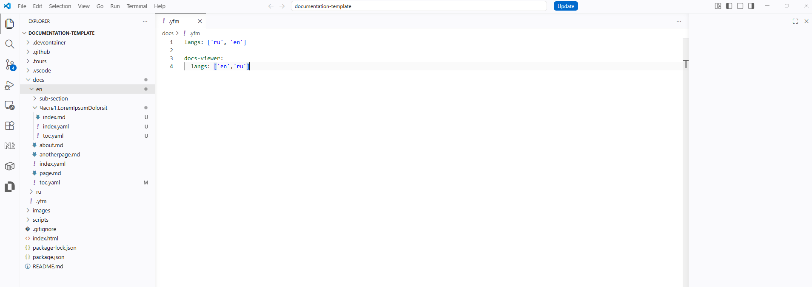

# Diplodoc Helper

[](https://marketplace.visualstudio.com/items?itemName=paulyestchick.diplodochelper)
[](CHANGELOG.md)

Помощник для технических писателей, работающих с Diplodoc / YFM

Значительно ускоряет создание, поддержку и рефакторинг документации.

Убирает рутину при работе с разделами, оглавлениями, ссылками и индексацией.



---

## Основные возможности

- **Создание разделов** любого уровня (Часть / Раздел / Глава / Статья)
- **Перемещение разделов** с автоматической переиндексацией
- **Переименование + смена типа** раздела с обновлением всех ссылок
- **Умная работа со ссылками** (копирование и вставка с автоматическим расчётом относительных путей)
- **Автоматическая генерация**:
    - Краткого указателя (контекстов)
    - Help Maps для фронтенда
- **Переиндексация** всей документации
- **Хлебные крошки** на страницах после сборки

---

## Установка

### marketplace

Установка осуществляется через [ссылку](https://marketplace.visualstudio.com/items?itemName=paulyestchick.diplodochelper)

### git

#### clone

Выполнить команду в терминале

```bash
git clone https://github.com/paulyeshchyk/diplodocHelper.git
```

#### build

Выполнить команду в терминале

```bash
cd diplodocHelper
npm install gray-matter@^4.0.3
mkDir build
vsce package --out build/ --allow-missing-repository
```

#### vsix install

Выполнить команду в терминале

```bash
code --install-extension diplodochelper-0.7.0.vsix
```

## Сводка функций

| Применяемость  | Наименование                                                                                                                                                       | Этап                   |
| -------------- | ------------------------------------------------------------------------------------------------------------------------------------------------------------------ | ---------------------- |
| Разделы        | [Создание раздела (`diplodoc-helper.createSection`)](#1-создание-раздела-diplodoc-helpercreatesection)                                                             | Редактирование         |
|                | [Удаление раздела (`diplodoc-helper.deleteSection`)](#2-удаление-раздела-diplodoc-helperdeletesection))                                                            | Редактирование         |
|                | [Переименование раздела и смена типа (`diplodoc-helper.renameSection`)](#3-переименование-раздела-и-смена-типа-diplodoc-helperrenamesection)                       | Редактирование         |
|                | [Перемещение раздела (`diplodoc-helper.moveSection`)](#4-перемещение-раздела-diplodoc-helpermoveSection)                                                           | Редактирование         |
| Ссылки         | [Копирование ссылки (`diplodoc-helper.copyLink`)](#5-копирование-ссылки-diplodoc-helpercopylink)                                                                   | Редактирование         |
|                | [Вставка ссылки (`diplodoc-helper.pasteLink`)](#6-вставка-ссылки-diplodoc-helperpastelink)                                                                         | Редактирование         |
|                | [Вставка изображения из буфера обмена (`diplodoc-helper.pasteImageFromClipboard`)](#7-вставка-изображения-из-буфера-обмена-diplodoc-helperpasteimagefromclipboard) | Редактирование         |
|                | [Вставка изображения из списка (`diplodoc-helper.pasteImageFromList`)](#8-вставка-изображения-из-списка-diplodoc-helperpasteimagefromlist)                         | Редактирование         |
| Конексты       | [Работа с `context`](#9-работа-с-context-контекст)                                                                                                                 | Редактирование, Сборка |
|                | [Работа с `helptag`](#10-работа-с-helptag)                                                                                                                         | Редактирование, Сборка |
| Индексация     | [Генерация страницы «Контексты» (`diplodoc-helper.generateContexts`)](#11-генерация-страницы-контексты-diplodoc-helpergeneratecontexts)                            | Редактирование, Сборка |
|                | [Генерация Help Map для фронтенда (`diplodoc-helper.generateHelpMaps`)](#12-генерация-help-map-для-фронтенда-diplodoc-helpergeneratehelpmaps)                      | Редактирование, Сборка |
|                | [Переиндексация (`diplodoc-helper.reindexDirectories`)](#13-переиндексация-diplodoc-helperreindex)                                                                 | Редактирование, Сборка |
|                | [Переиндексация рисунков (`diplodoc-helper.reindexFigures`)](#14-переиндексация-рисунков-diplodoc-helperreindexfigures)                                            | Редактирование, Сборка |
| Хлебные крошки | [Хлебные крошки (`inject-breadcrumb.js`)](#16-генерация-хлебных-крошек-diplodoc-helpergeneratebreadcrumbs)                                                         | Сборка                 |

## Команды расширения Diplodoc Helper

### 1. Создание раздела (`diplodoc-helper.createSection`)

**Без расширения**

Приходится вручную создавать папку, в ней — `index.md`, `index.yaml`, `toc.yaml`, заполнять frontmatter (`title`, `sectionType`, `pureTitle`, `sectionIndex`), затем вручную редактировать родительский `toc.yaml` — добавлять новый элемент `items` с правильным `name`, `href`, `include`.

**С расширением**

Достаточно кликнуть правой кнопкой мыши на папке и выбрать **Diplodoc → Создать рубрику**.  
Расширение само запрашивает тип раздела и название, автоматически вычисляет индекс, создаёт все необходимые файлы и добавляет запись в родительское оглавление.

---

### 2. Удаление раздела (`diplodoc-helper.deleteSection`)

**Без расширения**

Необходимо вручную удалить папку раздела, затем открыть родительский `toc.yaml` и удалить соответствующий блок `items`. Легко оставить «мусор» в оглавлении.

**С расширением**

Правой кнопкой по разделу → **Diplodoc → Удалить рубрику**.  
Расширение автоматически удаляет запись из родительского `toc.yaml`, а затем удаляет папку. Оглавление остаётся чистым.

---

### 3. Переименование раздела и смена типа (`diplodoc-helper.renameSection`)

**Без расширения**

Приходится вручную переименовывать папку, править `title`, `pureTitle`, `sectionType`, `sectionIndex` в `index.md` и `index.yaml`, обновлять заголовок в `toc.yaml` и родительских файлах, а также обновлять все ссылки.

**С расширением**

Правой кнопкой → **Diplodoc → Задать новый тип и наименование**.  
Расширение позволяет изменить тип и название, обновляет все метаданные, переименовывает папку (при необходимости), корректирует ссылки и сортирует `toc.yaml`.

---

### 4. Перемещение раздела (`diplodoc-helper.moveSection`)

**Без расширения**

Чтобы переместить раздел (главу, подраздел, статью) из одного места документации в другое, техпису приходилось:

- Вырезать папку вручную,
- Удалять запись о ней в toc.yaml старого родителя,
- Добавлять запись в toc.yaml нового родителя (с правильным name, href, include),
- Обновлять ссылки в index.yaml обоих родителей,
- Править индексы в index.md и index.yaml как в старом, так и в новом месте (особенно болезненно при вставке «посередине»),
- Запускать переиндексацию, чтобы всё остальное не развалилось.

**С расширением**

Правой кнопкой → **Diplodoc → Переместить рубрику**.  
Достаточно кликнуть правой кнопкой мыши на нужном разделе и выбрать «Переместить раздел».

Расширение позволяет:

- Выбрать целевую папку внутри текущего языка (docs/ru),
- Указать точное место вставки (в начало, в конец или после конкретного раздела),
- Автоматически удаляет запись из старого родителя,
- Добавляет запись в новый родитель с сохранением корректного include,
- Переименовывает папку в соответствии с новым индексом и типом (если требуется)

---

### 5. Копирование ссылки (`diplodoc-helper.copyLink`)

**Без расширения**

Приходится вручную копировать путь к файлу/папке и формировать Markdown-ссылку.

**С расширением**

Правой кнопкой по папке, `.md` или изображению → **Diplodoc → Копировать ссылку на документ**.  
Расширение сохраняет в буфер JSON с именем и путём для последующей удобной вставки.

---

### 6. Вставка ссылки (`diplodoc-helper.pasteLink`)

**Без расширения**

Нужно вручную вычислять относительный путь, кодировать кириллицу, правильно писать `[]()` или ``.

**С расширением**

В Markdown-файле выполнить команду **Вставить ссылку на документ**.  
Расширение читает данные из буфера, вычисляет корректный относительный путь и вставляет готовую ссылку.

---

### 7. Вставка изображения из буфера обмена (`diplodoc-helper.pasteImageFromClipboard`)

**Без расширения**

Приходится сохранять картинку вручную в папку `images`, придумывать имя, писать ``.

**С расширением**

В открытом `.md`-файле выполнить команду **Вставить рисунок из буфера обмена**.  
Расширение сохраняет изображение в папку `images/`, предлагает название, вставляет готовый блок figure с идентификатором.

---

### 8. Вставка изображения из списка (`diplodoc-helper.pasteImageFromList`)

**С расширением**

Показывает все изображения проекта и позволяет быстро выбрать и вставить нужное.

---

### 9. Работа с `context` (Контекст)

**Добавить / Изменить** (`diplodoc-helper.context.Update`)  
**Удалить** (`diplodoc-helper.context.Delete`)

**С расширением**  
Удобный интерфейс для управления полем `context:` в frontmatter раздела.

---

### 10. Работа с `helptag`

**Добавить / Изменить** (`diplodoc-helper.helptag.Update`)  
**Удалить** (`diplodoc-helper.helptag.Delete`)

**С расширением**  
Простой способ управления полем `helptag:` для интеграции с фронтендом.

---

### 11. Генерация страницы «Контексты» (`diplodoc-helper.generateContexts`)

**Без расширения**

Приходится вручную собирать все `context:`, создавать страницы, поддерживать актуальность.

**С расширением**

Команда **Создать страницу контекстов**.  
Расширение автоматически сканирует документацию, создаёт папку `contexts/` с алфавитным указателем и отдельными страницами для каждого термина.

---

### 12. Генерация Help Map для фронтенда (`diplodoc-helper.generateHelpMaps`)

**Без расширения**

Вручную собирать JSON с `url`, `title`, `hint`, `helptag`, `context`.

**С расширением**

Команда **Создать карту ключей (helptag)**.  
Создаёт `build/app-help-contents.json` (или по языкам) — готовые данные для всплывающих подсказок в приложении.

---

### 13. Переиндексация (`diplodoc-helper.reindex`)

**Без расширения**

После изменений структуры приходится вручную править индексы, названия папок и все связанные файлы.

**С расширением**

Команда **Переиндексировать папки**.  
Полностью пересчитывает индексы, обновляет метаданные, переименовывает папки и синхронизирует всю структуру.

---

### 14. Переиндексация рисунков (`diplodoc-helper.reindexFigures`)

Обновляет идентификаторы и ссылки на все фигуры и изображения в документации.

---

### 15. Очистка пустых папок (`diplodoc-helper.wipeEmptyDirectories`)

**С расширением**  
Команда **Удалить пустые папки** — полезна после переиндексации и перемещений.

---

### 16. Генерация хлебных крошек (`diplodoc-helper.generateBreadcrumbs`)

**С расширением**  
После сборки проекта (`@diplodoc/cli`) выполняется команда **Сформировать breadcrumbs**.  
Автоматически вставляет навигационную цепочку на каждую страницу в `build/`.

---

## Рекомендуемый порядок работы

1. Создание структуры (`Создать рубрику`)
2. Заполнение `context` и `helptag`
3. Перемещение/переименование при необходимости
4. **Переиндексация**
5. Генерация **Контекстов** и **Help Map**
6. Сборка проекта → **Хлебные крошки**

---

В результате структура документации остаётся целостной, все ссылки и индексы — актуальными.

**Расширение значительно ускоряет работу с документацией Diplodoc и минимизирует рутинные ошибки.**

## С чего начать

### Базис

Начните с загрузки стандартного проекта diplodoc, размещенного по [ссылке](https://github.com/diplodoc-platform/documentation-template)

---

Откройте проект, убедившись, что в папке `docs` есть две подпапки `en` и `ru`

---

Установите данное расширение.

---

После установки расширение, возможно, потребуется перезагрузка VS Code. После перезагрузки, в VS Code откройте зангуренный Вами проект documentation-template

---

В древовидной иерархии папок VS Code, под названием Explorer, найдите папку docs а в ней либо ru либо en. Если расширение из п.2 было установлено, тогда нажмите ПКМ. В появившемся меню должно быть подменю `diplodoc` 

---

Выберите подменю `Создать рубрику`, и следуйте дальнейшим инструкциям

- тип 
- название секции 
- индекс 

---

В результате, у Вас должно получиться создать новый подраздес а автоматическим обновлением toc.yaml

### Копирование

Функция `Копирование ссылки на статью` имеет пару `Вставка ссылки на статью`. Не путайте со стандартном механизмом `Копирования-Вставки`.

P.S. Функция вставки ссылки на статью будет работать только в документе формата md, yaml

[результат](./readme_images/section-creation-result.png)

## Базовый набор задач, исполняемых в VS Code

- `1. Собрать документацию` преобразовывает(собирает) весь набор md-файлов в набор html- файлов
- `2. Открыть (локальный сервер)` преобразовывает(собирает) весь набор md-файлов в набор html- файлов, запуская локальный http-server. Результат сборки будет доступен по адресу `localhost:5050`
- `5. docker: build image` преобразовывает(собирает) весь набор md-файлов в набор html- файлов, компонуя из них docker-container

Готовый перечень для внедрения в VS Code [tasks.json](./readme_images/tasks_ru.json)
