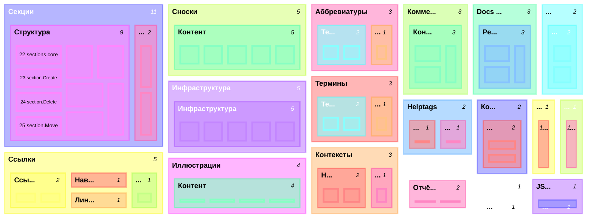

```mermaid
treemap-beta
"Ссылки"
    "Навигация"
        "1 breadcrumb": 1
    "Линтеры"
        "19 linter.links": 1
    "Ссылки"
        "27 link.Copy": 1
        "28 link.addAnchor": 1
    "Ссылки / Навигация"
        "29 link.Paste": 1
"ГОСТы"
    "Терминология"
        "2 gosts": 1
        "35 gosts.client": 1
"Аббревиатуры"
    "Терминология"
        "3 abbrs": 1
        "4 abbrs.client": 1
    "Линтеры"
        "20 linter.abbrs": 1
"Термины"
    "Терминология"
        "5 terms": 1
        "6 terms.client": 1
    "Линтеры"
        "26 linter.terms": 1
"Иллюстрации"
    "Контент"
        "7 figures": 1
        "30 image.PasteFromClipboard": 1
        "31 image.PasteFromList": 1
        "42 reindexer.figures": 1
"Helptags / Контексты"
    "Навигация"
        "8 helpMap": 1
"Контексты"
    "Навигация"
        "9 contexts": 1
        "34 context-search.client": 1
    "Отчёты"
        "16 contextmap": 1
"Helptags"
    "Навигация"
        "10 helptags": 1
    "Отчёты"
        "17 helptagmap": 1
"Сноски"
    "Контент"
        "11 footnotes": 1
        "12 footnoteAnchors": 1
        "13 footnoteNumbering": 1
        "14 footnoteList": 1
        "36 footnoteList.client": 1
"Секции"
    "Отчёты"
        "15 bytescounter": 1
        "18 presetsStat": 1
    "Структура"
        "22 sections.core": 1
        "23 section.Create": 1
        "24 section.Delete": 1
        "25 section.Move": 1
        "26 section.Rename": 1
        "39 file.Delete": 1
        "40 smart.delete": 1
        "41 reindexer.directories": 1
        "43 reindexer.md": 1
"Дорожная карта"
    "Отчёты"
        "32 roadmap": 1
        "33 roadmap.patcher": 1
"Helptags / Контексты / Секции"
    "Отчёты"
        "37 core-renderer": 1
"Контекстные теги"
    "Навигация"
        "38 context-tags.client": 1
        "45 context-tags": 1
""
    "Режимы отображения"
        "44 tocCleanMode": 1
"Инфраструктура"
    "Инфраструктура"
        "46 diplodoc-helper-cli": 1
        "47 docs-build": 1
        "48 manifest": 1
        "49 installer": 1
        "50 build.js": 1
"Комментарии пользователей"
    "Контент"
        "51 comments": 1
        "52 comments.server": 1
        "53 comments.admin": 1
"JSON генераторы"
    "Конвертер"
        "54 json-to-md": 1
"Docs Registry"
    "Реестр"
        "54 collectCatalog": 1
        "55 buildPageLegend": 1
        "56 renderModules": 1
```
