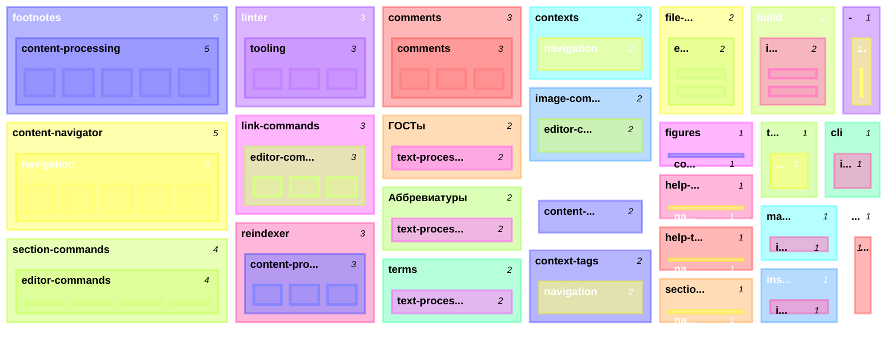

```mermaid
treemap-beta
"-"
    "navigation"
        "4.2-001": 1:::active
"ГОСТы"
    "text-processing"
        "3.1-002": 1:::active
        "5.1-035": 1:::active
"Аббревиатуры"
    "text-processing"
        "3.2-003": 1:::active
        "5.2-004": 1:::active
"terms"
    "text-processing"
        "3.2-005": 1:::active
        "3.2-006": 1:::active
"figures"
    "content-processing"
        "2.2-007": 1:::active
"help-map"
    "navigation"
        "8.2-008": 1:::active
"contexts"
    "navigation"
        "3.2-009": 1:::active
        "5.1-034": 1:::active
"help-tags"
    "navigation"
        "3.2-010": 1:::active
"footnotes"
    "content-processing"
        "3.2-011": 1:::active
        "4.2-012": 1:::active
        "4.2-013": 1:::active
        "4.2-014": 1:::active
        "5.1-036": 1:::active
"content-navigator"
    "navigation"
        "4.2-015": 1:::active
        "4.2-016": 1:::active
        "4.2-017": 1:::active
        "8.2-018": 1:::active
        "5.2-037": 1:::active
"linter"
    "tooling"
        "7.1-019": 1:::active
        "7.1-020": 1:::active
        "7.1-021": 1:::active
"sections"
    "navigation"
        "1.1-022": 1:::active
"section-commands"
    "editor-commands"
        "1.1-023": 1:::active
        "1.1-024": 1:::active
        "1.1-025": 1:::active
        "1.1-026": 1:::active
"link-commands"
    "editor-commands"
        "2.2-027": 1:::active
        "2.1-028": 1:::active
        "2.2-029": 1:::active
"image-commands"
    "editor-commands"
        "2.2-030": 1:::active
        "2.2-031": 1:::active
"roadmap"
    "content-processing"
        "8.2-032": 1:::active
        "4.2-033": 1:::active
"context-tags"
    "navigation"
        "5.1-038": 1:::active
        "4.2-045": 1:::active
"file-commands"
    "editor-commands"
        "1.2-039": 1:::active
        "1.2-040": 1:::active
"reindexer"
    "content-processing"
        "1.2-041": 1:::active
        "1.2-042": 1:::active
        "1.2-043": 1:::active
"toc"
    "navigation"
        "4.2-044": 1:::active
"cli"
    "infrastructure"
        "6.2-046": 1:::active
"build"
    "infrastructure"
        "6.2-047": 1:::active
        "6.2-050": 1:::active
"manifest"
    "infrastructure"
        "6.2-048": 1:::active
"installer"
    "infrastructure"
        "6.2-049": 1:::active
"comments"
    "comments"
        "5.3-051": 1:::active
        "6.2-052": 1:::active
        "5.1-053": 1:::active
"Generators"
    "Data representation"
        "8.2-054": 1:::active
```
